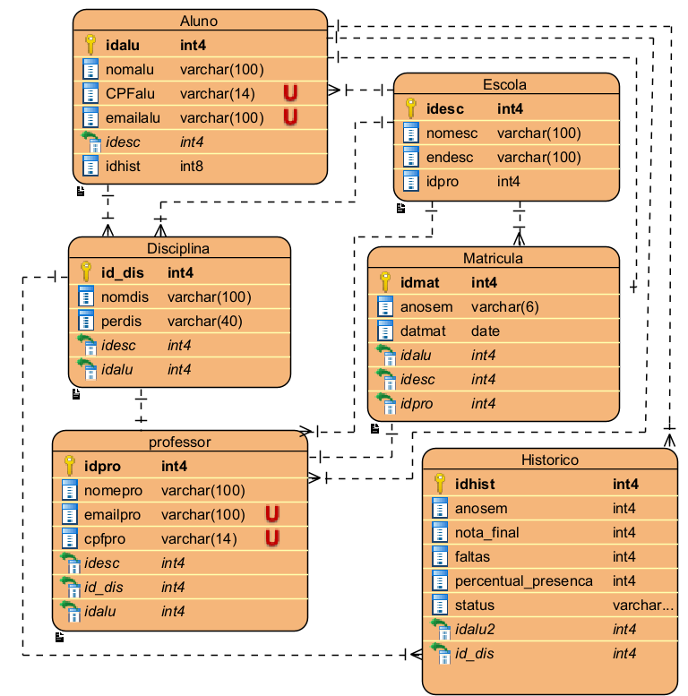

# 🎓 Gestão Acadêmica Integrada e Automatizada (GAIA)

Um sistema de banco de dados para gerenciar matrículas, notas e frequência em instituições de ensino, desenvolvido como trabalho acadêmico para a disciplina de Banco de Dados.

## 📌 Índice
- [Objetivo](#-objetivo)
- [Funcionalidades](#-funcionalidades)
- [Tecnologias](#-tecnologias)
- [Equipe](#-equipe)
- [Modelagem do Banco](#-modelagem-do-banco)
  - [Diagrama ER](#diagrama-er)
  - [Script SQL](#script-sql)
  - [Relatórios SQL](#-relatórios-sql)
- [Licença](#-licença)

## 🎯 Objetivo
Automatizar processos acadêmicos como matrículas, lançamento de notas e geração de relatórios, garantindo:
- Integridade dos dados
- Eficiência nas operações
- Consultas complexas otimizadas

## ✨ Funcionalidades
| Módulo          | Descrição                                                                 |
|-----------------|---------------------------------------------------------------------------|
| Cadastros       | Alunos, professores, disciplinas e turmas                                |
| Matrículas      | Validação de pré-requisitos e lotação de turmas                          |
| Notas/Frequência| Lançamento com cálculos automáticos (médias, situações)                  |
| Relatórios      | Alunos Matriculados, Notas de um Aluno, Frequência dos Alunos em uma Disciplina e Resumo de Aprovação por Disciplina e Período |

## 💻 Tecnologias
**Banco de Dados**:
- 

**Ferramentas**:
- 
- 


## 👥 Equipe
| Nome               |
|--------------------|
| Edson Silveira      |
| Cleverson Mozer        |
| Mauricio Bairos    | 
| Tiago da Luz    | 

## 🗃️ Modelagem do Banco
### Diagrama ER


### Script SQL
```sql
-- Tabela: Escola
CREATE TABLE Escola (
    idesc SERIAL PRIMARY KEY,
    nomesc VARCHAR(100) NOT NULL,
    endesc VARCHAR(100),
    idpro INT
);

-- Tabela: Aluno
-- Criação do banco de dados
CREATE DATABASE sistema_academico_integrado;
\c sistema_academico_integrado;

-- Tabela: Escola
CREATE TABLE Escola (
    idesc SERIAL PRIMARY KEY,
    nomesc VARCHAR(100) NOT NULL,
    endesc VARCHAR(100),
    idpro INT
);

-- Tabela: Aluno
CREATE TABLE Aluno (
    idalu SERIAL PRIMARY KEY,
    nomalu VARCHAR(100) NOT NULL,
    CPFalu VARCHAR(14) UNIQUE NOT NULL,
    emailalu VARCHAR(100) UNIQUE NOT NULL,
    idesc INT NOT NULL,
    idhist BIGINT,
    FOREIGN KEY (idesc) REFERENCES Escola(idesc) ON DELETE CASCADE
);

-- Tabela: Disciplina
CREATE TABLE Disciplina (
    id_dis SERIAL PRIMARY KEY,
    nomdis VARCHAR(100) NOT NULL,
    perdis VARCHAR(40),
    idesc INT NOT NULL,
    idalu INT,
    FOREIGN KEY (idesc) REFERENCES Escola(idesc) ON DELETE CASCADE,
    FOREIGN KEY (idalu) REFERENCES Aluno(idalu)
);

-- Tabela: Professor
CREATE TABLE Professor (
    idpro SERIAL PRIMARY KEY,
    nomepro VARCHAR(100) NOT NULL,
    emailpro VARCHAR(100) UNIQUE NOT NULL,
    cpfpro VARCHAR(14) UNIQUE NOT NULL,
    idesc INT NOT NULL,
    id_dis INT,
    idalu INT,
    FOREIGN KEY (idesc) REFERENCES Escola(idesc),
    FOREIGN KEY (id_dis) REFERENCES Disciplina(id_dis),
    FOREIGN KEY (idalu) REFERENCES Aluno(idalu)
);

-- Tabela: Matricula
CREATE TABLE Matricula (
    idmat SERIAL PRIMARY KEY,
    anosem VARCHAR(6) NOT NULL CHECK (char_length(anosem) = 6),
    datmat DATE NOT NULL,
    idalu INT NOT NULL,
    idesc INT NOT NULL,
    idpro INT NOT NULL,
    FOREIGN KEY (idalu) REFERENCES Aluno(idalu),
    FOREIGN KEY (idesc) REFERENCES Escola(idesc),
    FOREIGN KEY (idpro) REFERENCES Professor(idpro)
);

-- Tabela: Historico
CREATE TABLE Historico (
    idhist BIGSERIAL PRIMARY KEY,
    anosem INT NOT NULL,
    nota_final INT CHECK (nota_final BETWEEN 0 AND 100),
    faltas INT CHECK (faltas >= 0),
    percentual_presenca INT CHECK (percentual_presenca BETWEEN 0 AND 100),
    status INT CHECK (status IN (0, 1)), -- 1 = Aprovado, 0 = Reprovado
    idalu2 INT NOT NULL,
    id_dis INT NOT NULL,
    FOREIGN KEY (idalu2) REFERENCES Aluno(idalu),
    FOREIGN KEY (id_dis) REFERENCES Disciplina(id_dis)
);
```
## 📊 Relatórios SQL

Consultas para análise acadêmica:

### 🔹 Alunos Matriculados (última matrícula por aluno)
```sql
SELECT 
    a.nomalu AS "Nome do Aluno",
    m.idmat AS "Matrícula",
    e.nomesc AS "Curso/Escola"
FROM Matricula m
JOIN Aluno a ON a.idalu = m.idalu
JOIN Escola e ON e.idesc = m.idesc
WHERE m.datmat = (
    SELECT MAX(datmat) 
    FROM Matricula m2 
    WHERE m2.idalu = m.idalu
)
ORDER BY a.nomalu;
```

### 🔹 Notas de um Aluno
```sql
SELECT 
    a.nomalu AS "Nome do Aluno",
    d.nomdis AS "Disciplina",
    h.nota_final AS "Nota Final",
    h.anosem AS "Semestre"
FROM Historico h
JOIN Aluno a ON a.idalu = h.idalu
JOIN Disciplina d ON d.id_dis = h.id_dis
WHERE a.idalu = ? -- Substitua pelo ID do aluno desejado
ORDER BY h.anosem DESC;
```

### 🔹 Frequência dos Alunos em uma Disciplina
```sql
SELECT 
    a.nomalu AS "Nome do Aluno",
    h.faltas AS "Faltas",
    h.percentual_presenca AS "Presença (%)"
FROM Historico h
JOIN Aluno a ON a.idalu = h.idalu
WHERE h.id_dis = ? -- Substitua pelo ID da disciplina
ORDER BY h.percentual_presenca DESC;
```

### 🔹 Resumo de Aprovação por Disciplina e Semestre
```sql
SELECT 
    d.nomdis AS "Disciplina",
    h.anosem AS "Semestre",
    COUNT(*) AS "Total Matriculados",
    SUM(CASE WHEN h.status = 'Aprovado' THEN 1 ELSE 0 END) AS "Aprovados",
    SUM(CASE WHEN h.status = 'Reprovado' THEN 1 ELSE 0 END) AS "Reprovados"
FROM Historico h
JOIN Disciplina d ON d.id_dis = h.id_dis
WHERE h.anosem = '2024-2' -- Substitua pelo semestre desejado
GROUP BY d.nomdis, h.anosem
ORDER BY "Total Matriculados" DESC;
```


## 📄 Licença
Este projeto está sob a licença MIT. Veja o arquivo [LICENSE](LICENSE) para detalhes.

---

> Desenvolvido para a disciplina de Banco de Dados I - Universidade do Oeste de Santa Catarina (2025)
